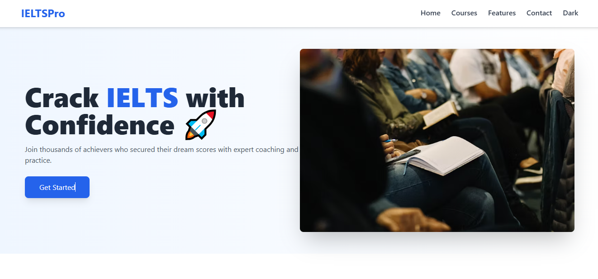
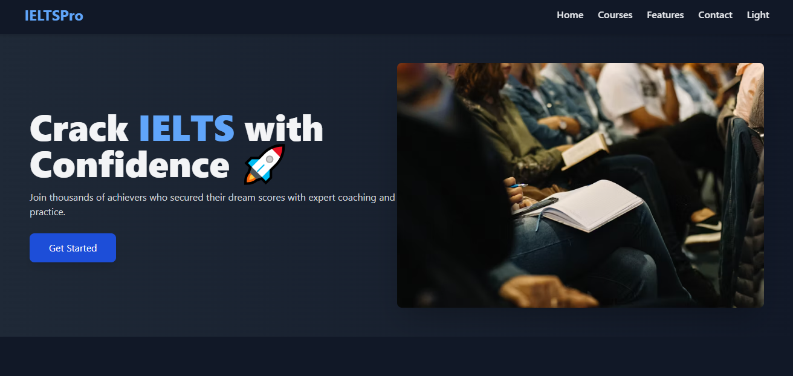
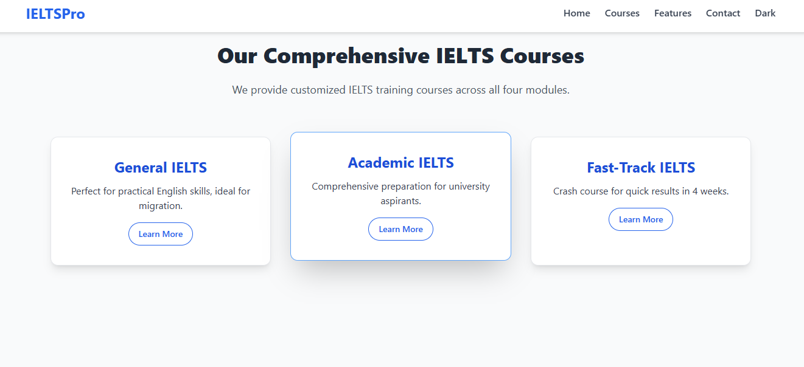
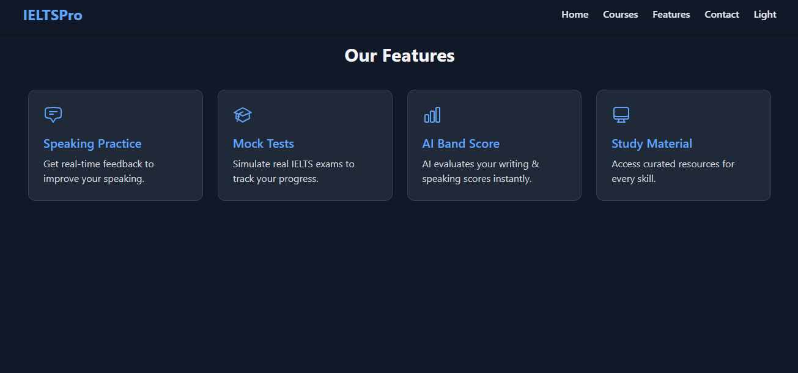

# IELTS Institute – Learning Platform

A modern, responsive website built with **React + Tailwind CSS** for an **IELTS Coaching Institute**.  
The goal is to provide a clean, professional, and interactive front-end experience for students preparing for IELTS.

## Live Demo

[View the Website Here](https://your-deployment-link.vercel.app)

## Features

1. **Modern UI** – Responsive design for desktop & mobile
2. **Dark Mode Toggle** – Switch between light and dark themes for comfort
<p align="center">
  
  
</p>
3. **Mobile-Friendly Navbar** – Hamburger menu with smooth animation
4. **Hero Section** – Eye-catching banner with call-to-action
5. **Courses Section** – Cards showing IELTS courses and details
<p align="center">
  
  
</p>
6. **Interactive Animations** – Hover effects & smooth transitions
7. **Easy Navigation** – Simple structure for quick access to info

## Tech Stack

- **Frontend:** React
- **Styling:** Tailwind CSS
- **Animations & Icons:** Framer Motion, Heroicons

## Getting Started

1. **Clone the repository**

```bash
git clone https://github.com/prajna-17/ielts-institute.git
cd ielts-institute

2. **Install dependencies**
   npm install

3. **Run the project**
   npm start

4. **Build for production**
   npm run build
```
